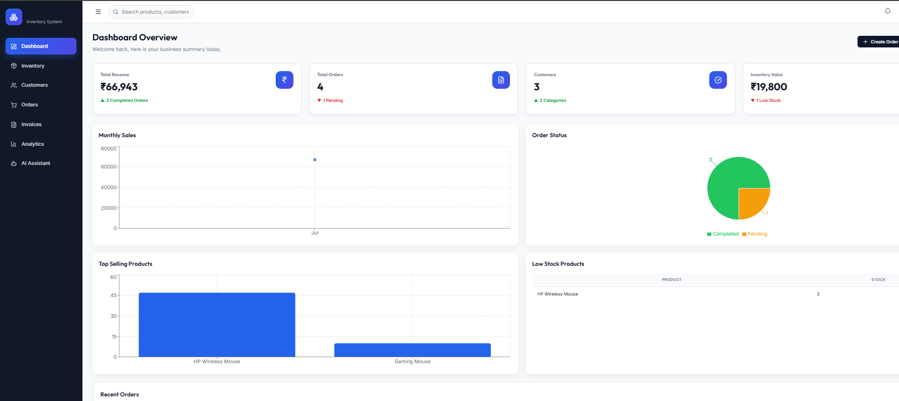
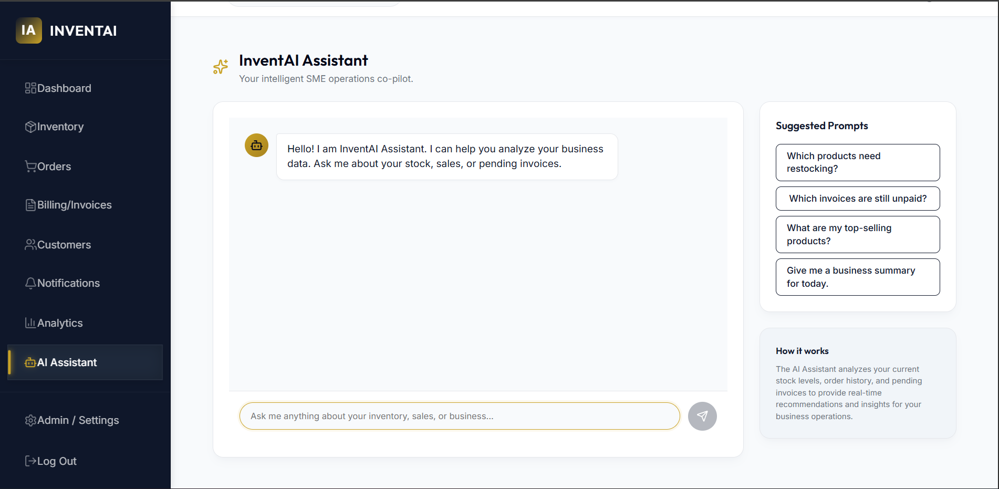
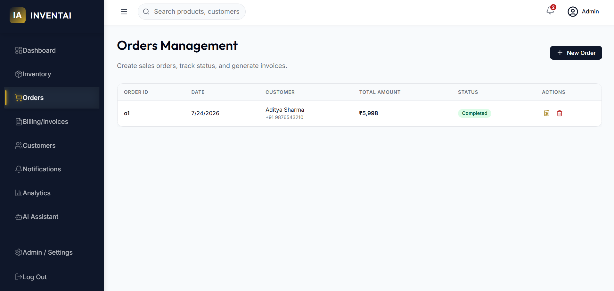
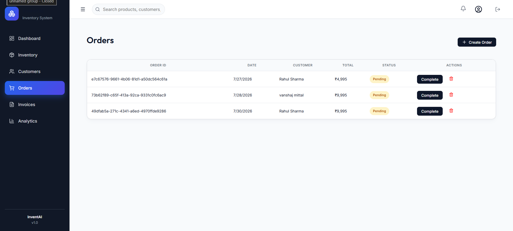
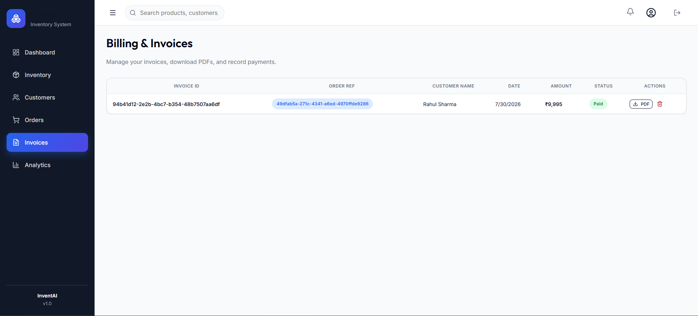
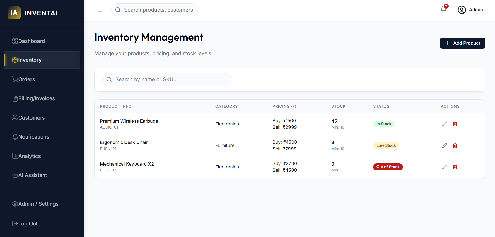
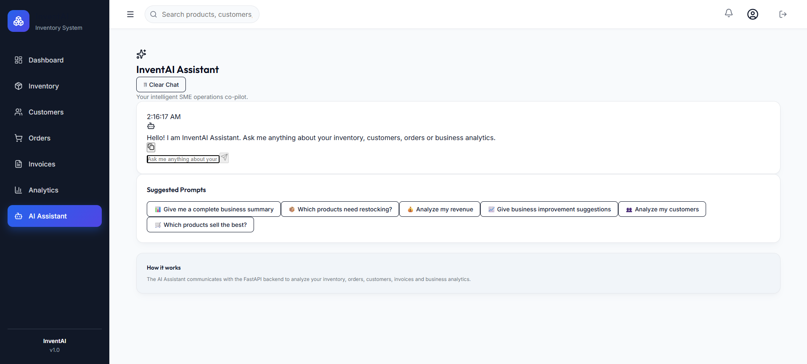

# 📦 InventAI

# 🌐 Live Demo

### Frontend
https://invent-ai-pi.vercel.app/

### Backend API (Swagger)
https://inventai-m4e4.onrender.com/docs

> A modern full-stack Inventory & Billing Management System with AI-powered business insights.


InventAI is a modern inventory and billing platform built for small and medium businesses to efficiently manage products, customers, orders, invoices, and business analytics through an intuitive dashboard.

The project follows a clean full-stack architecture using React + TypeScript on the frontend and FastAPI + PostgreSQL on the backend.

---

# ✨ Features

## 📌 Project Highlights

- 30+ REST API endpoints
- 7 business management modules
- Secure JWT Authentication
- AI-powered Business Assistant using Google Gemini
- PostgreSQL database with SQLAlchemy ORM
- Interactive analytics dashboard with Recharts

## 🔐 Authentication

- Secure JWT Authentication
- User Login & Registration
- Protected Routes
- Password Hashing

---

## 📦 Inventory Management

- Add Products
- Update Products
- Delete Products
- Product Search
- Category Management
- Inventory Valuation

---

## 👥 Customer Management

- Customer Profiles
- Customer History
- Contact Information
- Order Tracking

---

## 🛒 Order Management

- Create Orders
- Order Status Tracking
- Complete Orders
- Delete Orders

---

## 🧾 Invoice Management

- Automatic Invoice Generation
- PDF Invoice Download
- Invoice History
- Payment Status

---

## 📊 Analytics Dashboard

- Revenue Analytics
- Monthly Sales Charts
- Order Status Distribution
- Top Selling Products
- Low Stock Monitoring
- Inventory Value
- Business KPIs

---

## 🤖 AI Business Assistant

- AI-powered business analytics
- Inventory health analysis
- Revenue and sales insights
- Customer behavior summaries
- Smart inventory recommendations
- Natural language business queries
- Context-aware responses using Google Gemini

---

# 🖼️ Screenshots

## Dashboard



---

## Inventory



---

## Customers



---

## Orders



---

## Invoices



---

## Analytics



---

## AI Business Assistant



---

# 🏗️ Tech Stack

## Frontend

- React
- TypeScript
- Vite
- Axios
- Recharts
- CSS

## Backend

- FastAPI
- SQLAlchemy
- PostgreSQL
- Pydantic
- JWT Authentication
- Bcrypt

---

# 🌐 Deployment

| Service | Platform |
|----------|----------|
| Frontend | Vercel |
| Backend | Render |
| Database | Neon PostgreSQL |
| AI Model | Google Gemini |

---

# 📁 Project Structure

```
InventAI
│
├── backend
│   ├── app
│   │   ├── api
│   │   ├── models
│   │   ├── schemas
│   │   ├── services
│   │   ├── database
│   │   └── core
│   └── requirements.txt
│
├── src
│   ├── api
│   ├── components
│   ├── pages
│   ├── hooks
│   └── styles
│
├── Screenshots
├── README.md
└── package.json
```

---

# 🏛️ Architecture

Frontend (React + TypeScript)

↓

REST API (FastAPI)

↓

SQLAlchemy ORM

↓

PostgreSQL (Neon)

↓

Google Gemini AI

---

# 🚀 Installation

## Clone Repository

```bash
git clone https://github.com/rathiraghav25/InventAI.git
cd InventAI
```

## Backend Setup

```bash
cd backend

python -m venv .venv

# Windows
.venv\Scripts\activate

# Linux / macOS
source .venv/bin/activate

pip install -r requirements.txt

uvicorn app.main:app --reload
```

Backend:

```
http://127.0.0.1:8000
```

Swagger:

```
http://127.0.0.1:8000/docs
```

## Frontend Setup

```bash
npm install
npm run dev
```

Frontend:

```
http://localhost:5173
```

---

# 🔑 Environment Variables

## Backend

Create a `.env` file inside the `backend` folder.

```env
DATABASE_URL=your_database_url
SECRET_KEY=your_secret_key
GEMINI_API_KEY=your_gemini_api_key
ACCESS_TOKEN_EXPIRE_MINUTES=60
```

## Frontend

For local development, create a `.env` file in the project root.

```env
VITE_API_URL=http://127.0.0.1:8000
```

For production (Vercel), configure:

```env
VITE_API_URL=https://inventai-m4e4.onrender.com
```

---

# 📚 API Documentation

After running the backend locally, visit:

http://127.0.0.1:8000/docs

to explore all available REST endpoints using Swagger UI.

---

# 🔮 Future Improvements

- Email Invoice Delivery
- Multi-language Support
- Inventory Forecasting
- Mobile Responsive Optimization

---

# 👨‍💻 Author

**Raghav Rathi**

B.Tech Electronics & Communication Engineering

Malaviya National Institute of Technology Jaipur

GitHub

https://github.com/rathiraghav25

LinkedIn

https://linkedin.com/in/raghavrathi752

---

# 📄 License

This project is licensed under the MIT License.

---

## ⭐ If you like this project, consider giving it a Star!